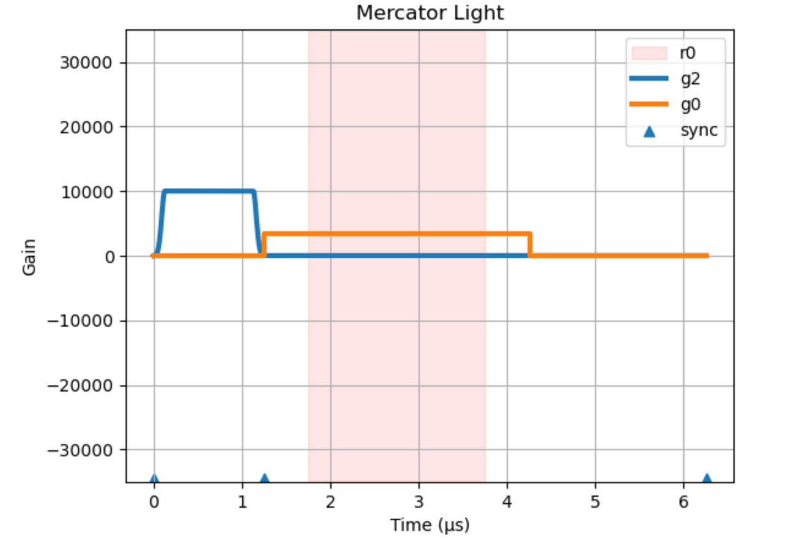

# Mercator Protocol

Mercator protocol is a syntax to specify a pulse sequence (QICK program). It is a set of key-value pairs. Conveniently, it can be writen as a Python dictionary or in [YAML format](https://en.wikipedia.org/wiki/YAML). This document will use YAML format for clearance.

Mercator protocol includes a lot of default values and syntax sugar to make it simultaneously flexible and easy to use. In this document, **default values will be used. Properties without default value will be marked as required.**

Mercator protocol is generally consisted of 4 sections:

- Meta information
- Pulse setup
- Readout setup
- Execution steps

For example, the following program is for QubitSpectroscopy (TwoTone) with very short relax time:

```yaml
# section 1: Meta Information
hard_avg: 1000
# section 2: Pulse Setup
p0_freq: 5000
p0_length: 3
p0_power: -30
p1_freq: 4000
p1_style: flat_top
p1_sigma: 0.05
p1_length: 1
p1_gain: 0.5
# section 3: Readout Setup
r0_p: 0
r0_length: 2
# section 4: Execution Steps
0_type: pulse
0_p: 1
0_g: 2
1_type: delay_auto
2_type: pulse
2_p: 0
2_g: 0
3_type: trigger
3_t: 0.5
4_type: delay_auto
4_t: 2
```

This program gives the following pulse sequence, plotted by `quick.Mercator.light`, showing only the I data waveform and the acquisition window (pink). For details about execution of Mercator protocol, see API References.



> More examples of Mercator protocol can be found in [default experiment programs](https://github.com/clelandlab/quick/blob/main/quick/constants/experiment.yml). Note they are up to variable insertion by `quick.evalStr`.

## Meta Information

This section often describes the program repetition and average times. You can also include your own key-value pairs, as long as they are not conflicting with other keys.

```yaml
hard_avg: 1        # on-board average times
soft_avg: 1        # average times in Python
rep: 0             # repetition without average (return all data)
                   # by dummy sweep
```

## Pulse Setup

In this section, you can prepare your pulses. All properties in this section have prefix `px_`, where `x` represents the pulse index. This document use `p0_` as an example.

```yaml
p0_freq: 5000      # (REQUIRED) [MHz] frequency
p0_gain: 0         # [-1, 1] gain
p0_nqz: 2          # [1, 2]nyquist zone
p0_mode: oneshot   # [oneshot|periodic]
p0_style: const    # [const|gaussian|DRAG|flat_top|stage|arb] pulse style
p0_phase: 0        # [deg] phase
p0_length: 2       # [us] length
p0_delta: -200     # [MHz] anharmonicity used in DRAG pulse
p0_mixer: None     # [MHz] mixer frequency
p0_mask: None      # [list] mask used in multiplexed pulse (mux)
p0_stage: []       # [list] list of stages [amplitude, time]
p0_idata: None     # [-1, 1] used in arb pulse, in DAC sample rates
p0_qdata: None     # [-1, 1] used in arb pulse, in DAC sample rates
```

**Syntax Sugar**: (optional)

```yaml
p0_sigma: 0.05     # [us] gaussian std in flat_top/gaussian/DRAG pulse.
                   # Its default value is 1/5 of p0_length
p0_phrst: 0        # [0|1] phase coherent reset
```

**Multiplexed Pulse (mux)**:

Passing lists to `freq`, `gain`, and `phase`. The list lengths must match with each other. Multiplexed pulse is configurated on generator level. Therefore all pulses on the mux generator must share the same mux settings (specified by the last-played pulse). You can change `length` and `mask` for individual pulses.

The gain value range shrinks with more tones (due to energy conservation). It takes `[-1, 1]` for 1 tone, `[-0.5, 0.5]` for 2 tones, `[-0.25, 0.25]` for 3 or 4 tones, and `[-0.125, 0.125]` for 5 to 8 tones.

```yaml
p0_style: const    # only support const
p0_freq: [5500, 6000, 6500]
p0_gain: [0.25, 0.25, 0.25]
p0_phase: [0, 0, 0]
p0_length: 2
p0_mask: [0, 1, 2] # defaulted to all
```

> Note: multiplexed readout channel must be set by frequency instead of linking pulse.

**Multiple Stage Pulse**:

```yaml
p0_style: stage
p0_stage: [[1, 0.1], [0.3, 1], [-1, 0.1], [0.1, 0.1]]
p0_sigma: 0.01     # [us] the standard deviation for gaussian filter.
```

Note: the total length of the pulse will be the sum of stage lengths, plus 8*sigma, and then pad zeros to the end until integer multiples of clock ticks.

## Readout Channel Setup

In this section, you can prepare your readout (ADC) channels. All properties in this section have prefix `rx_`, where `x` represents the readout channel number. This document use `r0_` as an example.

```yaml
r0_freq: 0         # [MHz] readout frequency
r0_length: 2       # [us] readout length
r0_phase: 0        # [deg] readout phase
```

**Syntax Sugar**: (important)

```yaml
r0_p: 0            # match one pulse for frequency down-conversion
                   # r0_freq is not required then.
```

## Execution Steps

In this section, you can describe a series of steps to be executed during the run time. All properties in this section have prefix `i_` where `i` is the step number starting from `0`. All step numbers MUST be consecutive. The program will stop if the next consecutive number is not found. This document use step `0` as an example.

Each step will be in the following syntax: 

```yaml
0_type: pulse      # (REQUIRED) [pulse|trigger|wait|wait_auto|delay|delay_auto|goto]
0_p: 0             # (for pulse) pulse index
0_g: 0             # (for pulse) generator channel
0_t: 0             # [us] time offset from last delay
```

The step `type` is required. It takes one of the following values:

- `pulse`: release a pulse `0_p` on generator channel `0_g`. Conditional pulses see below.
- `trigger`: trigger the readout. `0_ch` should be an array, defaulted to all readout channels.
- `wait`: wait until a specific time.
- `wait_auto`: wait for all channel plus a specific time
- `delay`: delay the following step
- `delay_auto`: delay the following step after all channels
- `goto`: (discussed below)

### goto

`goto` step can jump to another step. It takes the following syntax:

```yaml
0_type: goto
0_i: 0             # (REQUIRED) target step number
0_rep: 0           # repetition times of this goto
```

> Note: The `goto` function will NOT create actual jump in the assembly code. Instead, it will expand the jump in Python and generate a program without jumps/loops.

### Conditional Pulse

Mercator protocol supports conditional pulses, especially for qubit active reset. The releasing of the pulse will be determined by the I data acquired in the last acquisition window on the fly. For example:

```yaml
3_type: trigger    # trigger acquisition
4_type: wait_auto
4_time: 2          # MUST wait for data
5_type: pulse      # conditional pulse
5_p: 1             # release pulse p1
5_g: 2             # on generator channel g2
5_threshold: 0     # threshold condition on I data
5_r: 0             # which readout channel, default to be 0
```

In this case, step 5 specifies that the pulse `p1` will be released on `g2` only if the I data acquired in step 3 is above the value in `5_threshold`. The corresponding readout channel is provided to obtain acquisition length.

### Syntax Sugar

The execution steps can also be writen as an array in Mercator protocol, for example:

```yaml
steps:
- type: pulse
  p: 0
  g: 0
- type: trigger
  t: 0.5
- type: wait_auto
- type: delay_auto
  t: 1
```

The Mercator *class* accepts any **combination** of the array format and the flat key-value format as previously discussed. But it will first **flatten** the `steps` array into the flat key-value format. **The flat key-value format has higher priority during this flattening process.**
