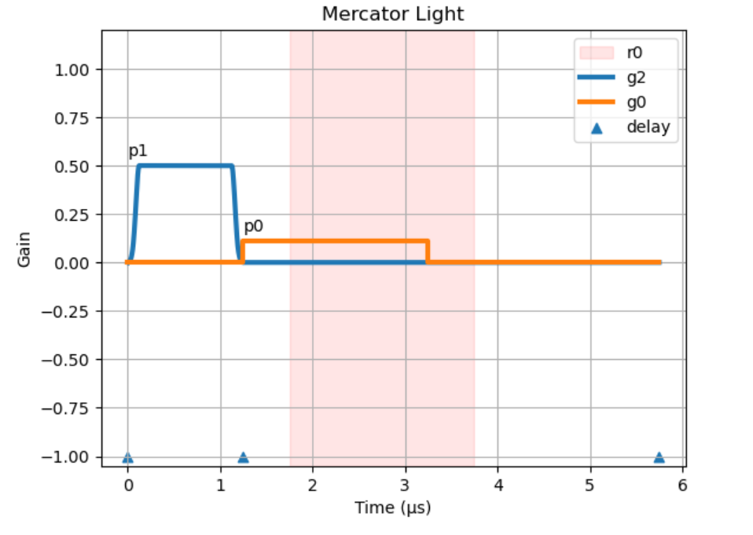

# Mercator Protocol

The Mercator protocol defines a pulse sequence (a QICK program) as a set of key-value pairs, typically written in YAML or as a Python dictionary. To execute it, use the `quick.Mercator` class.

> Note: Avoid using `{}` in YAML, as it can conflict with `quick.evalStr`.

The protocol uses defaults and syntax sugar for flexibility and ease of use. This document lists default values, and **REQUIRED** properties are marked.

The protocol has four main sections:
- Meta Information
- Pulse Setup
- Readout Setup
- Execution Steps

For example, this program defines a QubitSpectroscopy (Two-Tone) experiment with a short relaxation time:

```yaml
# section 1: Meta Information
hard_avg: 1000
# section 2: Pulse Setup
p0_freq: 5000
p0_length: 3
p0_power: -30
p1_freq: 4000
p1_style: flat_top
p1_sigma: 0.05
p1_length: 1
p1_gain: 0.5
# section 3: Readout Setup
r0_p: 0
r0_length: 2
# section 4: Execution Steps
steps: # using syntax sugar here
- type: pulse
  p: 1
  g: 2
- type: delay_auto
- type: pulse
  p: 0
  g: 0
- type: trigger
  t: 0.5
- type: delay_auto
  t: 2
```

This program generates the following pulse sequence, plotted by `quick.Mercator.light`:



> More examples, often using variable insertion via `quick.evalStr`, are available in the [default experiment programs](https://github.com/clelandlab/quick/blob/main/quick/constants/experiment.yml).

## Meta Information

Defines program repetitions and averaging. Custom key-value pairs are allowed if they don't conflict with existing keys.

```yaml
hard_avg: 1        # On-board (FPGA) averages.
soft_avg: 1        # Software (Python) averages.
rep: 0             # Repetitions without averaging (returns all data).
```

## Pulse Setup

Define pulses. Properties are prefixed with `px_`, where `x` is the pulse index (e.g., `p0_`).

```yaml
p0_freq: 5000      # (REQUIRED) Frequency (MHz).
p0_gain: 0         # Gain [-1, 1].
p0_nqz: 2          # Nyquist zone [1|2]. Use 1 for DC/low frequencies.
p0_mode: oneshot   # Pulse mode: `oneshot` or `periodic`.
p0_style: const    # Pulse style: `const`, `gaussian`, `DRAG`, `flat_top`, `stage`, `arb`.
p0_phase: 0        # Phase (degrees).
p0_length: 2       # Length (µs).
p0_delta: -200     # Anharmonicity (MHz) for DRAG pulse.
p0_mixer: None     # Mixer frequency (MHz) for up/down conversion.
p0_mask: None      # Channel mask [list] for multiplexed (mux) pulse.
p0_stage: []       # Stages `[amplitude, time]` for `stage` style pulse.
p0_idata: None     # I data for `arb` pulse (DAC samples, [-1, 1]).
p0_qdata: None     # Q data for `arb` pulse (DAC samples, [-1, 1]).
```

**Syntax Sugar** (optional):

```yaml
p0_power: -30      # internally use quick.dB2gain, will overwrite `p0_gain`.
p0_sigma: 0.05     # Gaussian std (µs) for `gaussian`/`DRAG`/`flat_top`. Defaults to p0_length/5.
p0_phrst: 0        # Phase coherent reset [0|1].
```

**Multiplexed (mux) Pulse**:

Use lists of matching lengths for `freq`, `gain`, and `phase`. Mux generator is configured by the last-played pulse on that generator. `length` and `mask` can be set individually.

Gain range scales with the number of tones: `[-1, 1]` for 1 tone; `[-0.5, 0.5]` for 2; `[-0.25, 0.25]` for 3-4; `[-0.125, 0.125]` for 5-8.

```yaml
p0_style: const    # Only `const` style is supported.
p0_freq: [5500, 6000, 6500]
p0_gain: [0.25, 0.25, 0.25]
p0_phase: [0, 0, 0]
p0_length: 2
p0_mask: [0, 1, 2] # Defaults to all channels.
```

> Note: A multiplexed readout must be set by frequency besides linking to a pulse.

**Multiple Stage Pulse**:

```yaml
p0_style: stage
p0_stage: [[1, 0.1], [0.3, 1], [-1, 0.1], [0.1, 0.1]] # List of [amplitude, time].
p0_sigma: 0.01     # Standard deviation (µs) for Gaussian filter.
```
> Note: `Total length = (sum of stage times) + 8*sigma`, padded to the next clock tick.
> The maximum amplitude of non-`const` pulses can be up to 2x weaker than a `const` pulse of the same gain.

## Readout Setup

Configure readout (ADC) channels. Properties are prefixed with `rx_`, where `x` is the channel number (e.g., `r0_`).

```yaml
r0_freq: 0         # Readout frequency (MHz).
r0_length: 2       # Readout length (µs).
r0_phase: 0        # Readout phase (degrees).
```

**Syntax Sugar** (important):

```yaml
r0_p: 0            # Link to a pulse for down-conversion frequency.
                   # If used, `r0_freq` is not required (except for mux readout).
```

## Execution Steps

Defines the sequence of operations. Steps are specified with a flat `i_` prefix (e.g., `0_type`), where the index `i` must be consecutive starting from 0. Execution stops at the first missing index. A more convenient list format is also available (see Syntax Sugar below).

```yaml
0_type: pulse      # (REQUIRED) Step type [options see below].
0_p: 0             # (for `pulse` type) Pulse index.
0_g: 0             # (for `pulse` type) Generator channel.
0_t: 0             # Time offset (µs) from last delay.
```

**Step Types**:
- `pulse`: Play pulse `p` on generator `g`.
- `trigger`: Trigger readout on channels `rs` (defaults to all).
- `wait`: Wait until absolute time `t`.
- `wait_auto`: Wait for all channels and readouts to finish, plus offset `t`.
- `delay`: Delay for duration `t`.
- `delay_auto`: Delay for duration `t` after all channels and readouts finish.
- `goto`: Jump to another step.

### Delay

Without using delay, all steps respect the same time axis regardless of their orders. `delay` can offset the origin of time by `t`, while `delay_auto` can automatically set the origin after all previous steps finish, plus a given offset `t`.

### Goto

The `goto` step jumps to another step to repeat a block of operations.

```yaml
0_type: goto
0_i: 0             # (REQUIRED) Target step index.
0_rep: 0           # Repetition count for this jump.
```

> Note: `goto` is not a real-time jump. It unrolls the loop during Python compilation, generating a linear sequence.

### Conditional Pulse

The protocol supports conditional pulses (e.g., for active reset) that execute based on the measured I-quadrature data from the last readout.

```yaml
3_type: trigger    # Trigger acquisition.
4_type: wait_auto  # MUST wait for data to be available.
4_t: 0.1
5_type: delay_auto # Delay until previous steps finish.
6_type: pulse      # Conditional pulse.
6_p: 1             # Play pulse p1...
6_g: 2             # ...on generator g2 if condition is met.
6_threshold: 0     # I-data threshold.
6_r: 0             # Readout channel to check (default 0).
```

In this example, the pulse `p1` at step 6 is played only if the I-data from readout channel `r: 0` (triggered at step 3) is above the `threshold`.

### Syntax Sugar

The `steps` list is a convenient alternative to the flat `i_` format. The `Mercator` class first flattens this list into the `i_` format. Any explicit `i_` properties will override values from the flattened list, allowing for a hybrid approach.

```yaml
steps:
- type: pulse
  p: 0
  g: 0
- type: trigger
  t: 0.5
- type: wait_auto
- type: delay_auto
  t: 1
```
