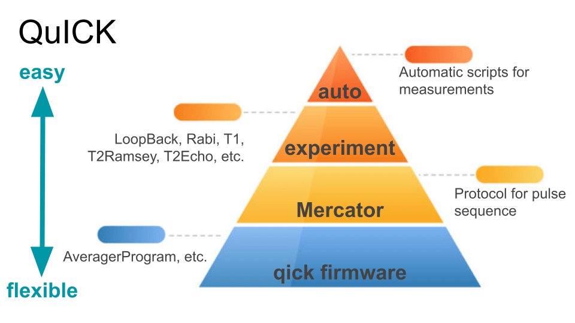

# Get Started

QuICK is a useful wrap of [QICK](https://github.com/openquantumhardware/qick).

<div>
  <a style="margin: 0.25rem;" href="https://clelandlab-quick.readthedocs.io/en/latest/"></a>
  <a style="margin: 0.25rem;" href="https://pypi.org/project/clelandlab-quick/"></a>
  <a style="margin: 0.25rem;" href="https://github.com/clelandlab/quick"></a>
</div>



## Installation

Install this package with `pip`:

```
pip install clelandlab-quick
```

> It is recommended to use a conda environment.

```python
import quick
```

## Document Convention

**All and only *class* are capitalized.**

The APIs fall into several accessibility:

- 🟢 very useful
- 🔵 sometimes useful
- 🟡 mostly internal use
- 🔴 broken or deprecated
